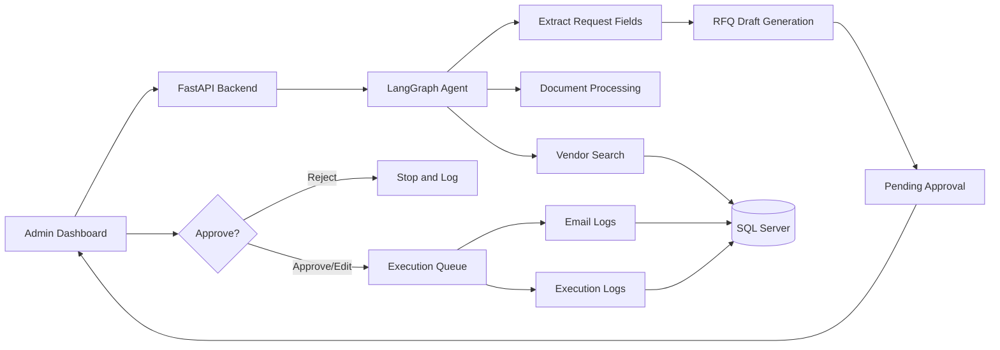

# ProcureAI - Procurement Agent System

ProcureAI is a production-oriented AI procurement assistant that helps procurement teams process purchase requests, extract structured information, match vendors, draft RFQ emails, and route sensitive actions through admin approval before execution.

This is not a simple chatbot. It is a stateful agentic workflow system with a FastAPI backend, LangGraph orchestration, SQL Server persistence, document extraction, approval controls, execution logging, and a React admin dashboard.

## Key Features

- Create and manage purchase requests.
- Extract structured procurement fields with OpenAI.
- Process email text and supported attachments.
- Extract content from PDF, Excel, CSV, Word, and TXT files.
- Detect document prompt-injection attempts.
- Store vendors, requests, actions, approvals, email logs, attachments, and execution logs in SQL Server.
- Search and rank active vendors by category, department, and rating.
- Generate professional RFQ email drafts.
- Require admin approval before execution.
- Prevent duplicate execution with idempotency keys.
- Log every workflow step and error.
- Provide a React dashboard for review, approval, rejection, and vendor management.

## Tech Stack

### Backend

- Python 3.12
- FastAPI
- LangGraph
- OpenAI API
- SQL Server
- SQLAlchemy
- pyodbc
- Pydantic
- pdfplumber, PyMuPDF, pypdf
- pandas, openpyxl
- python-docx
- Python logging
- Docker-ready backend structure

### Frontend

- React
- Vite
- React Router
- Lucide React icons
- CSS dashboard UI
- Vercel-ready frontend config

### Database

- Microsoft SQL Server Azure SQL Database in production.
- SQLite is allowed only for explicit automated test mode.

## Architecture



## Agent Workflow

The LangGraph workflow is implemented with separate nodes:

1. `receive_request`
2. `detect_input_source`
3. `extract_email_text`
4. `detect_attachments`
5. `extract_attachment_content`
6. `merge_context`
7. `extract_request_fields`
8. `validate_extraction`
9. `search_vendors`
10. `rank_vendors`
11. `generate_rfq_drafts`
12. `email_guardrail_check`
13. `create_pending_approval`
14. `wait_for_admin_approval`
15. `execute_approved_action`
16. `log_completion`

The agent proposes actions only. Admin approval is required before execution.

## Document Processing

Supported input types:

- Email body text
- PDF
- XLSX / XLS
- CSV
- DOCX
- TXT
- PNG/JPG OCR-ready placeholder

Document guardrails:

- Files are treated as untrusted input.
- File names are sanitized.
- Suspicious extensions are rejected.
- File size and MIME type are validated.
- Extracted text and table cells are sanitized.
- Prompt-injection phrases such as `ignore previous instructions`, `bypass approval`, and `reveal system prompt` are detected and logged.
- Extraction failures mark the request as `NeedsReview` instead of crashing the workflow.

## Project Structure

```text
procurement-agent/
├── backend/
│   ├── app/
│   │   ├── api/
│   │   ├── agent/
│   │   ├── services/
│   │   ├── tools/
│   │   ├── main.py
│   │   ├── config.py
│   │   ├── database.py
│   │   ├── models.py
│   │   └── schemas.py
│   ├── scripts/
│   ├── sql/
│   ├── tests/
│   ├── requirements.txt
│   ├── Dockerfile
│   └── vercel.json
├── frontend/
│   ├── src/
│   ├── package.json
│   ├── vite.config.js
│   └── vercel.json
├── docs/
│   ├── agent_pipeline.md
│   └── agent_pipeline.mmd
└── README.md
```

## Required Environment Variables

Create a backend environment file:

```powershell
cd procurement-agent/backend
copy .env.example .env
```

If `.env.example` is not present, create `.env` manually.

### Backend `.env`

For local SQL Server:

```env
APP_NAME=Procurement Agent
ENVIRONMENT=development
LOG_LEVEL=INFO

DB_SERVER=localhost,1433
DB_NAME=procurement
DB_USER=sa
DB_PASSWORD=your_sql_password
DB_DRIVER=
DB_TRUST_SERVER_CERTIFICATE=true
DB_ENCRYPT=no
DATABASE_URL=

OPENAI_API_KEY=your_openai_api_key
OPENAI_MODEL=gpt-4.1-mini

FRONTEND_ORIGIN=http://localhost:5173,http://127.0.0.1:5173,http://localhost:3000,http://127.0.0.1:3000
ADMIN_API_TOKEN=change-this-local-dev-token

UPLOAD_STORAGE_DIR=storage/uploads
MAX_UPLOAD_BYTES=10485760
MAX_DOCUMENT_CHARS=24000

ENABLE_REAL_EMAIL_SEND=false
SMTP_HOST=
SMTP_PORT=587
SMTP_USER=
SMTP_PASSWORD=
SMTP_FROM_EMAIL=
```

For Azure SQL Database:

```env
DB_SERVER=your-server-name.database.windows.net,1433
DB_NAME=your_database_name
DB_USER=your_sql_admin_user
DB_PASSWORD=your_sql_admin_password
DB_DRIVER=ODBC Driver 18 for SQL Server
DB_ENCRYPT=yes
DB_TRUST_SERVER_CERTIFICATE=false
```

Do not commit `.env` files. They are intentionally ignored by Git.

### Frontend `.env`

Create:

```powershell
cd procurement-agent/frontend
copy .env.example .env
```

Set:

```env
VITE_API_BASE_URL=http://127.0.0.1:8000
```

For a deployed frontend, use the deployed backend URL:

```env
VITE_API_BASE_URL=https://your-backend-url
```

Never put database credentials, OpenAI keys, SMTP passwords, or admin tokens in frontend environment variables.

## SQL Server Setup

### Local SQL Server

1. Install SQL Server Developer or SQL Server Express.
2. Enable SQL Server Authentication.
3. Enable TCP/IP in SQL Server Configuration Manager.
4. Set TCP port to `1433`.
5. Restart SQL Server.
6. Create a database named `procurement`.
7. Configure the backend `.env`.

### Azure SQL Database

Recommended settings:

- Authentication: SQL and Microsoft Entra authentication
- Networking: Public endpoint
- Allow Azure services: Yes
- Add your current client IP to firewall rules
- Minimum TLS: 1.2
- Backup redundancy: Locally-redundant

Use the Azure SQL server name in this format:

```env
DB_SERVER=your-server.database.windows.net,1433
```

## Install ODBC Driver

Windows:

1. Install Microsoft ODBC Driver 18 for SQL Server.
2. If Driver 18 is unavailable, Driver 17 can be used locally.

Check installed drivers:

```powershell
uv run python -c "import pyodbc; print(pyodbc.drivers())"
```

## Run Locally

From the repository root:

```powershell
uv python install 3.12
uv venv --python 3.12
uv sync
```

Run backend checks:

```powershell
cd procurement-agent/backend
uv run python scripts/check_environment.py
uv run python scripts/init_db.py
uv run python scripts/seed_data.py
uv run python scripts/check_fullstack_config.py
```

Start backend:

```powershell
uv run python -m uvicorn app.main:app --reload --port 8000
```

Start frontend:

```powershell
cd ../frontend
npm install
npm run dev
```

Open:

```text
http://localhost:5173
```

Backend docs:

```text
http://127.0.0.1:8000/docs
```

Health checks:

```powershell
curl http://127.0.0.1:8000/health
curl http://127.0.0.1:8000/health/db
```

## Local Automation Scripts

Run from `procurement-agent/backend`:

```powershell
uv run python scripts/check_environment.py
uv run python scripts/init_db.py
uv run python scripts/seed_data.py
uv run python scripts/e2e_test.py
uv run python scripts/check_fullstack_config.py
uv run python scripts/start_backend.py
```

Script purpose:

- `check_environment.py`: validates Python packages, env vars, ODBC driver, SQL Server connection, and tables.
- `init_db.py`: creates missing tables and safely adds missing columns without dropping data.
- `seed_data.py`: inserts sample vendors and a sample request idempotently.
- `e2e_test.py`: runs a full workflow test with mocked deterministic extraction.
- `check_fullstack_config.py`: validates frontend/backend URL and CORS configuration.
- `start_backend.py`: runs checks before starting Uvicorn.

## Test the Workflow

Example request:

```text
Sarah from IT needs 12 business laptops for onboarding next month. Budget is around 18000 USD. Please request quotes from approved IT hardware vendors.
```

Expected flow:

1. Create a request from the dashboard.
2. Agent extracts requester, department, item, category, quantity, urgency, budget, and date.
3. Agent searches active vendors in SQL Server.
4. Agent drafts RFQ emails.
5. Proposed action is stored as `PendingApproval`.
6. Admin reviews the request.
7. Admin approves, edits and approves, or rejects.
8. Execution logs and email logs are stored.

## API Endpoints

- `GET /health`
- `GET /health/db`
- `POST /auth/dev-login`
- `GET /auth/me`
- `POST /auth/logout`
- `POST /requests`
- `POST /requests/email`
- `GET /requests`
- `GET /requests/overview`
- `GET /requests/{request_id}`
- `GET /approvals/pending`
- `POST /approvals/{action_id}/approve`
- `POST /approvals/{action_id}/reject`
- `POST /approvals/{action_id}/edit-approve`
- `GET /logs/{request_id}`
- `GET /vendors`
- `POST /vendors`
- `PUT /vendors/{vendor_id}`

## Deployment Notes

### Frontend on Vercel

The frontend can be deployed to Vercel from:

```text
procurement-agent/frontend
```

Vercel settings:

```text
Framework: Vite
Build command: npm run build
Output directory: dist
```

Set this Vercel environment variable:

```env
VITE_API_BASE_URL=https://your-backend-url
```

### Backend Deployment

The backend includes Vercel configuration, but this project uses SQL Server through `pyodbc` and an ODBC driver. That is not always reliable on Vercel serverless. The recommended production backend hosts are:

- Azure App Service
- Azure Container Apps
- Render Docker service
- Railway
- A VPS with Docker

If deploying the backend outside local development, configure:

```env
ENVIRONMENT=production
DB_SERVER=your-server.database.windows.net,1433
DB_NAME=your_database
DB_USER=your_user
DB_PASSWORD=your_password
DB_DRIVER=ODBC Driver 18 for SQL Server
DB_ENCRYPT=yes
DB_TRUST_SERVER_CERTIFICATE=false
OPENAI_API_KEY=your_openai_key
ADMIN_API_TOKEN=strong_random_secret
FRONTEND_ORIGIN=https://your-vercel-domain
```

Production auth should replace local dev auth with SSO/OIDC, server-side sessions, RBAC, CSRF protection, and audit identity.

## Safety Controls

- The agent does not send emails without admin approval.
- The agent does not delete database records.
- The agent does not overwrite vendor data automatically.
- LLM output is validated with Pydantic.
- Low-confidence or incomplete extraction routes to `NeedsReview`.
- Guardrail failures stop execution.
- Rejected actions cannot execute.
- Duplicate execution is blocked with idempotency keys.
- Secrets are never stored in frontend code.
- Documents are sanitized before LLM processing.
- Prompt-injection attempts are logged.
- SQL queries use SQLAlchemy parameterization.
- Execution logs are stored for auditability.

## Tests

Run backend tests:

```powershell
cd procurement-agent/backend
uv run pytest tests -q
```

Covered areas:

- Vendor search
- Field validation
- Prompt-injection guardrails
- Status transition rules
- Duplicate action prevention
- Duplicate email execution prevention
- Document extraction failure handling
- Graph workflow route checks

## Production Hardening

Recommended next steps:

- Replace dev auth with production identity management.
- Add Alembic migrations instead of relying on automatic metadata sync.
- Move execution jobs to Celery, RQ, or another durable queue.
- Store attachments in Azure Blob Storage or S3.
- Add antivirus scanning for uploads.
- Add OCR workers for scanned PDFs/images.
- Add rate limiting.
- Add structured logs to Azure Monitor, Datadog, or OpenTelemetry.
- Add a real SMTP provider if email sending is required.
- Rotate any local secrets that were ever exposed during development.

