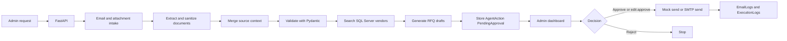

# Procurement Agent

A production-oriented AI procurement assistant built with FastAPI, LangGraph, OpenAI, SQL Server, SQLAlchemy, and React.

The system is intentionally approval-first: the agent proposes RFQ drafts, stores them as `PendingApproval`, and waits for an admin to approve, edit, or reject before any execution step can run.

Document and attachment inputs are treated as untrusted external data. The backend validates file type, size, MIME type, and filename, stores files locally for development, extracts and sanitizes content, detects prompt-injection phrases, logs extraction errors, and preserves field source traceability.

## Architecture



## Agent Workflow

The LangGraph nodes are implemented as separate functions:

1. `receive_email`
2. `detect_attachments`
3. `extract_email_text`
4. `extract_attachment_content`
5. `merge_context`
6. `validate_extraction`
7. `search_vendors`
8. `rank_vendors`
9. `generate_rfq_drafts`
10. `email_guardrail_check`
11. `create_pending_approval`
12. `wait_for_admin_approval`
13. `execute_approved_action`
14. `log_completion`

Initial request processing stops after the pending approval is created. `execute_approved_action` is called only by the approval API after an admin decision.

## Document Processing

Supported uploads:

- PDF
- XLSX
- XLS
- CSV
- DOCX
- TXT
- PNG/JPG as OCR-ready placeholders

Processing rules:

- If email text and attachments exist, the system reads both and merges them.
- If only attachments exist, it processes attachments and continues normally.
- Structured attachment values such as quantities and prices are preferred over vague body text.
- Conflicts are preserved in `conflicts` and force `NeedsReview`.
- Extraction failures are logged and do not crash the workflow.
- Suspicious instructions such as `ignore previous instructions`, `bypass approval`, or `reveal system prompt` are removed before LLM processing and logged as review findings.

Attachment metadata is stored in `RequestAttachments`. Extraction output is stored in `DocumentExtractions` with text, tables, structured quotation details, confidence, errors, and review flags.

## Project Structure

```text
procurement-agent/
+-- backend/
|   +-- app/
|   +-- sql/
|   +-- requirements.txt
|   +-- .env.example
|   +-- Dockerfile
+-- frontend/
|   +-- src/
|   +-- package.json
|   +-- .env.example
+-- README.md
```

## Create the SQL Server Database

Normal local runtime requires SQL Server. SQLite is allowed only for automated tests with `ENVIRONMENT=test`.

1. Install SQL Server Developer or SQL Server Express.
2. Enable SQL Server Authentication and create or enable a SQL login.
3. Open SQL Server Configuration Manager.
4. Enable `TCP/IP` for the SQL Server instance.
5. Set or verify TCP port `1433` under `IPAll`.
6. Restart the SQL Server service.
7. Open SQL Server Management Studio or Azure Data Studio.
8. Connect with an account that can create databases.
9. Run [backend/sql/schema.sql](backend/sql/schema.sql).
10. Run [backend/sql/seed.sql](backend/sql/seed.sql) for example vendors and a sample request.

The app also calls `Base.metadata.create_all()` at startup, but the SQL script is provided for controlled environments.

## Install ODBC Driver

Windows:

1. Install Microsoft ODBC Driver 18 for SQL Server from Microsoft, or use Driver 17 if it is already installed.
2. The backend auto-detects `ODBC Driver 18 for SQL Server` first, then `ODBC Driver 17 for SQL Server`.
3. To force a driver, set `DB_DRIVER=ODBC Driver 17 for SQL Server` or `DB_DRIVER=ODBC Driver 18 for SQL Server`.

Check installed drivers:

```powershell
uv run python -c "import pyodbc; print(pyodbc.drivers())"
```

Linux:

```bash
curl -fsSL https://packages.microsoft.com/keys/microsoft.asc | sudo gpg --dearmor -o /usr/share/keyrings/microsoft-prod.gpg
curl -fsSL https://packages.microsoft.com/config/ubuntu/22.04/prod.list | sudo tee /etc/apt/sources.list.d/mssql-release.list
sudo apt-get update
sudo ACCEPT_EULA=Y apt-get install -y msodbcsql18 unixodbc-dev
```

## Configure Environment

Backend:

```bash
cd procurement-agent/backend
cp .env.example .env
```

Set:

```env
ENVIRONMENT=development
DB_SERVER=localhost,1433
DB_NAME=ProcurementAgent
DB_USER=your_sql_user
DB_PASSWORD=your_sql_password
DB_DRIVER=
DB_TRUST_SERVER_CERTIFICATE=true
DB_ENCRYPT=no
DATABASE_URL=
OPENAI_API_KEY=your_openai_key
ADMIN_API_TOKEN=change-this-admin-token
UPLOAD_STORAGE_DIR=storage/uploads
MAX_UPLOAD_BYTES=10485760
MAX_DOCUMENT_CHARS=24000
FRONTEND_ORIGIN=http://localhost:5173,http://127.0.0.1:5173,http://localhost:3000,http://127.0.0.1:3000
```

Leave `DB_DRIVER` empty to auto-detect Driver 18, then Driver 17. Do not set `DATABASE_URL=sqlite...` for normal runtime; startup rejects SQLite unless `ENVIRONMENT=test`.

Frontend:

```bash
cd procurement-agent/frontend
cp .env.example .env
```

Set:

```env
VITE_API_BASE_URL=http://127.0.0.1:8000
```

Do not put database credentials, OpenAI keys, SMTP credentials, or admin tokens in frontend environment variables.
In local development, the backend creates an HttpOnly dev admin session cookie from `POST /auth/dev-login`.
Production should replace dev auth with SSO/OIDC, server-side sessions, RBAC claims, CSRF protection, and audit identity.

## Run Backend

Backend dependencies are managed from the repository root with `uv`, Python 3.12, `pyproject.toml`, and `uv.lock`.
`backend/requirements.txt` is kept only as a legacy/reference mirror.

From the repository root:

```powershell
uv python install 3.12
uv venv --python 3.12
uv sync
cd procurement-agent/backend
uv run python scripts/init_db.py
uv run python scripts/check_environment.py
uv run python scripts/seed_data.py
uv run python scripts/check_fullstack_config.py
uv run python -m uvicorn app.main:app --reload --port 8000
```

Health check:

```bash
curl http://localhost:8000/health
curl http://localhost:8000/health/db
```

Or use the helper:

```powershell
uv run python scripts/start_backend.py
```

On Windows, you can run the uv setup helper from the repository root:

```powershell
.\scripts\setup_windows_uv.ps1
```

If an old `.venv` blocks uv from switching to Python 3.12, close terminals/editors using it and remove it from the repository root:

```powershell
Remove-Item -Recurse -Force .venv
```

If uv reports a cache permission error, remove the workspace cache and rerun setup:

```powershell
Remove-Item -Recurse -Force .uv-cache
```

## Local Automation Scripts

Run these from `procurement-agent/backend`:

```powershell
uv run python scripts/init_db.py
uv run python scripts/check_environment.py
uv run python scripts/check_fullstack_config.py
uv run python scripts/seed_data.py
uv run python scripts/e2e_test.py
uv run python scripts/start_backend.py
```

- `check_environment.py` verifies Python packages, required environment variables, ODBC driver selection, SQL Server TCP reachability, pyodbc login, and required tables.
- `init_db.py` safely creates missing SQLAlchemy tables without dropping data.
- `seed_data.py` safely inserts fake `example.com` vendors and a sample request only if missing.
- `e2e_test.py` runs a deterministic full workflow using the configured database and mocked local extraction.
- `start_backend.py` runs the environment check before starting Uvicorn.

## Run Frontend

```bash
cd procurement-agent/frontend
npm install
npm run dev
```

Open `http://localhost:5173`.

## Local CORS Troubleshooting

If Uvicorn logs `400 Bad Request` for `OPTIONS` requests, check the local frontend and backend origins:

```powershell
cd procurement-agent/backend
uv run python scripts/check_fullstack_config.py
```

For local development, backend `FRONTEND_ORIGIN` should include:

```env
FRONTEND_ORIGIN=http://localhost:5173,http://127.0.0.1:5173,http://localhost:3000,http://127.0.0.1:3000
```

Frontend `.env` should use:

```env
VITE_API_BASE_URL=http://127.0.0.1:8000
```

Test a preflight manually:

```powershell
curl.exe -i -X OPTIONS "http://127.0.0.1:8000/requests/overview" -H "Origin: http://localhost:5173" -H "Access-Control-Request-Method: GET"
```

Expected: HTTP 200 or 204 with `Access-Control-Allow-Origin` present.

If Vite opens as a LAN URL such as `http://192.168.1.7:5173`, keep `VITE_API_BASE_URL=http://127.0.0.1:8000` when using the browser on the same machine. Development CORS allows private LAN frontend origins on ports `5173` and `3000`; production still requires explicit origins and does not use wildcard CORS.

## Docker Backend

```bash
cd procurement-agent/backend
docker build -t procurement-agent-backend .
docker run --env-file .env -p 8000:8000 procurement-agent-backend
```

## Test the Workflow

1. Start SQL Server and run the schema and seed scripts.
2. Start the backend.
3. Start the frontend.
4. Go to `Create Request`.
5. Submit this example:

```text
Sarah from IT needs 12 business laptops for onboarding next month. Budget is around 18000 USD. Please request quotes from approved IT hardware vendors.
```

6. Open the created request and inspect logs.
7. Go to `Pending Approvals`.
8. Review the proposed RFQ drafts.
9. Approve, edit and approve, or reject.

After approval, the backend creates `EmailLogs`. By default, messages are marked `ReadyToSend` and are not actually sent.

## API Endpoints

- `POST /requests`
- `POST /requests/email`
- `GET /requests`
- `GET /requests/{request_id}`
- `GET /requests/overview`
- `GET /approvals/pending`
- `POST /approvals/{action_id}/approve`
- `POST /approvals/{action_id}/reject`
- `POST /approvals/{action_id}/edit-approve`
- `GET /logs/{request_id}`
- `GET /vendors`
- `POST /vendors`
- `PUT /vendors/{vendor_id}`

## Approval System

The agent never sends or executes sensitive actions during extraction and drafting.

- All proposed RFQs are stored in `AgentActions` with `PendingApproval`.
- Admin approval creates an `Approvals` row.
- Only approved actions can call `execute_approved_action`.
- Rejected actions update the request status and do not execute.
- Edited approvals replace `ProposedOutput` before execution.

## What Is Mocked

Email delivery is mocked by default.

When `ENABLE_REAL_EMAIL_SEND=false`, approved RFQs create `EmailLogs` with status `ReadyToSend`. To send real email, configure SMTP settings and set:

```env
ENABLE_REAL_EMAIL_SEND=true
SMTP_HOST=smtp.example.com
SMTP_PORT=587
SMTP_USER=your_user
SMTP_PASSWORD=your_password
SMTP_FROM_EMAIL=procurement@example.com
```

## Safety Controls

- No frontend secrets.
- SQL Server credentials stay in backend `.env`.
- Pydantic validates LLM extraction and RFQ drafts.
- Missing required fields or low confidence marks the request `NeedsReview`.
- Vendor data is read by the agent and changed only through admin endpoints.
- There are no delete endpoints.
- Every workflow node writes an `ExecutionLogs` row.
- Execution logs include placeholders for latency, LLM token usage, and LLM cost.
- Uploaded files are stored under `UPLOAD_STORAGE_DIR` for development; use object storage in production.
- File names are sanitized, path traversal is rejected, suspicious extensions are rejected, and max upload size is enforced.
- Errors are logged without exposing configured secret names.
- `ADMIN_API_TOKEN` signs a local-development HttpOnly admin session cookie; it is never placed in frontend code.
- `AgentActions` and `EmailLogs` use idempotency keys to prevent duplicate proposals and duplicate email execution.
- Action status transitions are enforced by a state machine; invalid paths such as `Rejected -> Executed` are rejected.
- Reusable decorators cover latency measurement, node execution logging, tool error handling, permission checks, and approval checks before risky execution.

## Testing

Sync backend dependencies from the repository root with `uv sync`, then run:

```powershell
cd procurement-agent/backend
uv run pytest tests -q
```

The included tests cover:

- vendor search
- request extraction validation
- prompt-injection guardrails
- approval/status transition rules
- duplicate action creation
- duplicate email execution prevention
- file extraction failure handling

## Production Hardening Notes

- Replace local dev auth with SSO/OIDC, server-side sessions, RBAC, audit identity, and CSRF protection.
- Move background execution from FastAPI `BackgroundTasks` to Celery, RQ, or a durable queue.
- Add migrations with Alembic instead of automatic `create_all`.
- Replace local attachment storage with S3, Azure Blob Storage, or another object storage provider.
- Add OCR workers for scanned PDFs and image attachments.
- Add antivirus scanning and content disarm/reconstruction for uploaded files.
- Add row-level audit history for edited approvals and vendor changes.
- Add rate limits and request body size limits.
- Store LLM prompts and model versions with action metadata for traceability.
- Add retry queues and dead-letter handling for SMTP and transient database failures.
- Encrypt secrets with your deployment secret manager.
- Add integration tests against a SQL Server test container.
- Add structured logging to a central sink such as OpenTelemetry, Azure Monitor, or Datadog.
