# Agent Pipeline

This document describes the procurement agent workflow, including input routing, document processing, guardrails, human approval, execution, and failure handling.

## High-Level ASCII Diagram

```text
START
  |
  v
receive_request
  |
  v
detect_input_source
  |
  +--> email only -----------+
  |                          v
  |                   extract_email_text
  |                          |
  |                          v
  |                   merge_context
  |
  +--> attachment only ------+
  |                          v
  |                   detect_attachments
  |                          |
  |                          v
  |                   extract_attachment_content
  |                          |
  |                          v
  |                   merge_context
  |
  +--> email + attachment ---+
                             v
                      extract_email_text
                             |
                             v
                      detect_attachments
                             |
                             v
                      extract_attachment_content
                             |
                             v
                      merge_context

merge_context
  |
  v
extract_request_fields
  |
  v
validate_extraction
  |
  +--> extraction failed / missing fields / conflicts --> NeedsReview --> wait_for_admin_approval
  |
  v
search_vendors
  |
  +--> no vendors found --> NeedsReview --> wait_for_admin_approval
  |
  v
rank_vendors
  |
  v
generate_rfq_drafts
  |
  v
email_guardrail_check
  |
  +--> guardrail failed --> NeedsReview --> wait_for_admin_approval
  |
  v
create_pending_approval
  |
  v
wait_for_admin_approval
  |
  +--> admin rejects --> log_rejection --> END
  |
  +--> admin edits + approves --+
  |                             v
  +--> admin approves ------> execute_approved_action
                                |
                                v
                         log_completion
                                |
                                v
                               END
```

## Mermaid Flowchart

```mermaid
flowchart TD
    START([START]) --> receive_request[receive_request]
    receive_request --> detect_input_source{detect_input_source}

    detect_input_source -->|Only email text| extract_email_text[extract_email_text]
    detect_input_source -->|Only attachment| detect_attachments[detect_attachments]
    detect_input_source -->|Email text and attachment| extract_email_text
    detect_input_source -->|No usable input| needs_review_input[NeedsReview: no usable input]

    extract_email_text --> email_has_attachment{Attachments present?}
    email_has_attachment -->|No| merge_context[merge_context]
    email_has_attachment -->|Yes| detect_attachments

    detect_attachments --> extract_attachment_content[extract_attachment_content]
    extract_attachment_content --> attachment_ok{Attachment extraction OK?}
    attachment_ok -->|Yes| merge_context
    attachment_ok -->|No| needs_review_attachment[NeedsReview: attachment extraction error]
    needs_review_attachment --> merge_context

    merge_context --> extract_request_fields[extract_request_fields]
    extract_request_fields --> extraction_ok{Field extraction OK?}
    extraction_ok -->|No| needs_review_extraction[NeedsReview: extraction failed]
    extraction_ok -->|Yes| validate_extraction[validate_extraction]

    validate_extraction --> valid_extraction{Valid extraction?}
    valid_extraction -->|No| needs_review_validation[NeedsReview: missing fields, low confidence, or conflicts]
    valid_extraction -->|Yes| search_vendors[search_vendors]

    search_vendors --> vendors_found{Vendors found?}
    vendors_found -->|No| needs_review_vendors[NeedsReview: no vendors found]
    vendors_found -->|Yes| rank_vendors[rank_vendors]

    rank_vendors --> selected_vendors{Selected vendors?}
    selected_vendors -->|No| needs_review_vendors
    selected_vendors -->|Yes| generate_rfq_drafts[generate_rfq_drafts]

    generate_rfq_drafts --> email_guardrail_check[email_guardrail_check]
    email_guardrail_check --> guardrail_passed{Guardrail passed?}
    guardrail_passed -->|No| needs_review_guardrail[NeedsReview: email guardrail failed]
    guardrail_passed -->|Yes| create_pending_approval[create_pending_approval]

    needs_review_input --> create_pending_approval
    needs_review_extraction --> create_pending_approval
    needs_review_validation --> create_pending_approval
    needs_review_vendors --> create_pending_approval
    needs_review_guardrail --> create_pending_approval

    create_pending_approval --> wait_for_admin_approval[wait_for_admin_approval]
    wait_for_admin_approval --> admin_decision{Admin decision}

    admin_decision -->|Reject| log_rejection[log rejection]
    log_rejection --> END_REJECT([END])

    admin_decision -->|Approve| execute_approved_action[execute_approved_action]
    admin_decision -->|Edit and approve| execute_approved_action

    execute_approved_action --> execution_ok{Execution OK?}
    execution_ok -->|No| needs_review_execution[NeedsReview or Failed: execution error]
    execution_ok -->|Yes| log_completion[log_completion]

    needs_review_execution --> log_completion
    log_completion --> END([END])
```



## Node Explanations

### START

Entry point for a new procurement request workflow.

### receive_request

Creates or loads the purchase request record and starts execution logging. The request may come from direct admin entry, an email body, attachments, or a combination.

### detect_input_source

Determines which sources are available:

- email body only
- attachment only
- both email body and attachments
- no usable input

This node sets `input_source`, `has_email_text`, and `has_attachments`, then routes empty input directly to review.

### extract_email_text

Reads and sanitizes the email body. It strips prompt-injection-like phrases, removes unsafe instructions, and treats the email as untrusted input.

### detect_attachments

Finds uploaded attachments linked to the request. It uses stored metadata such as filename, MIME type, size, source type, hash, and extraction status.

### extract_attachment_content

Extracts text, tables, and structured quotation data from supported files:

- PDF
- XLSX
- XLS
- CSV
- DOCX
- TXT
- PNG/JPG as OCR-ready placeholders

Extraction errors are logged and converted into `NeedsReview` instead of crashing the workflow.

### merge_context

Combines email body context and attachment context into a single sanitized extraction context. It does not call the LLM and does not perform field extraction.

If conflicting values are detected, such as email quantity `10` and PDF quantity `15`, the conflict is preserved and the request is marked for review.

### extract_request_fields

Uses the LLM to extract structured procurement fields from the merged context:

- requester name
- department
- item description
- category
- quantity
- urgency
- budget
- required date

The LLM output must pass Pydantic validation.
After structured extraction, source traceability is attached to fields and structured attachment values can override vague email values.

### validate_extraction

Applies deterministic validation:

- required fields must exist
- quantity must be greater than zero
- budget must be greater than or equal to zero
- confidence must be between zero and one
- low confidence or missing fields trigger `NeedsReview`
- detected conflicts trigger `NeedsReview`

### search_vendors

Searches SQL Server for active vendors matching category and, when available, department.

### rank_vendors

Ranks active matching vendors using deterministic rules such as rating and category match. If no suitable vendor exists, the workflow marks the request as `NeedsReview`.

### generate_rfq_drafts

Generates professional RFQ email drafts for selected vendors. This creates draft content only. It does not send email.

### email_guardrail_check

Checks generated RFQ drafts for unsafe content, injected instructions, approval bypass wording, or confidential-data leakage. If the guardrail fails, the workflow marks the action as `NeedsReview`.

### create_pending_approval

Stores the proposed RFQ action in the database as `PendingApproval`. The proposed output includes:

- extracted fields
- source traceability
- conflicts
- matched vendors
- selected vendors
- RFQ drafts
- validation errors
- extraction errors

### wait_for_admin_approval

Pauses the workflow until an admin reviews the proposed action.

### execute_approved_action

Runs only after admin approval. In development, email sending is mocked and approved RFQs become `ReadyToSend` email logs. Real SMTP sending requires explicit configuration.

### log_completion

Writes final execution logs and closes the workflow.

### END

Terminal state for completed, rejected, or safely failed workflows.

## Conditional Routing

### Only Email Text Exists

```text
receive_request
-> detect_input_source
-> extract_email_text
-> merge_context
-> extract_request_fields
```

Attachment extraction is skipped.

### Only Attachment Exists

```text
receive_request
-> detect_input_source
-> detect_attachments
-> extract_attachment_content
-> merge_context
-> extract_request_fields
```

The workflow continues normally using extracted document content.

### Email Text and Attachments Exist

```text
receive_request
-> detect_input_source
-> extract_email_text
-> detect_attachments
-> extract_attachment_content
-> merge_context
-> extract_request_fields
```

Both sources are extracted and merged. Structured attachment values are preferred when email text is vague.

## Failure Paths

Failures do not directly execute actions or crash the workflow. They are logged and routed into review.

Common failure paths:

- corrupted PDF
- password-protected PDF
- unsupported file type
- OCR-required scanned PDF
- malformed Excel file
- empty attachment
- duplicate attachment
- LLM JSON validation failure
- missing required procurement fields
- no matching vendors found
- RFQ guardrail failure
- email execution failure

Failure routing:

```text
failure detected
-> log_execution
-> mark request/action NeedsReview or Failed
-> create_pending_approval when safe
-> wait_for_admin_approval
```

## Human Approval Path

The agent never executes risky actions directly.

```text
create_pending_approval
-> wait_for_admin_approval
-> admin_decision
```

Admin options:

- approve
- edit and approve
- reject

If rejected:

```text
admin rejects
-> log_rejection
-> END
```

If approved:

```text
admin approves
-> execute_approved_action
-> log_completion
-> END
```

In the initial request-processing graph, `wait_for_admin_approval` is a pause/logging node. The approve, edit-approve, reject, and execute paths are triggered by the approval API after the admin decision.

## Document/PDF Processing Path

Documents are treated as untrusted external input.

```text
detect_attachments
-> classify_attachment_type
-> validate file type, MIME type, size, and filename
-> extract_attachment_content
-> sanitize extracted text
-> detect prompt injection
-> normalize document text
-> extract tables and quotation fields
-> merge_context
```

PDF extraction attempts readable text and table extraction. If a PDF appears scanned or unreadable, the system flags `OCR_REQUIRED` and marks the request for review.

Quotation-oriented extraction attempts to detect:

- vendor name
- quotation number
- item rows
- quantities
- prices
- total amount
- delivery date
- validity period

## Email Guardrail Path

The RFQ draft is checked before it can become an executable approved action.

```text
generate_rfq_drafts
-> email_guardrail_check
-> pass: create_pending_approval
-> fail: NeedsReview -> create_pending_approval
```

Guardrails look for unsafe content such as:

- instructions to bypass approval
- requests to reveal secrets
- prompt-injection text copied from attachments
- confidential-data exfiltration language

Even if the guardrail fails, the proposed action is stored for admin visibility. It cannot execute unless an admin explicitly approves or edits and approves it.
